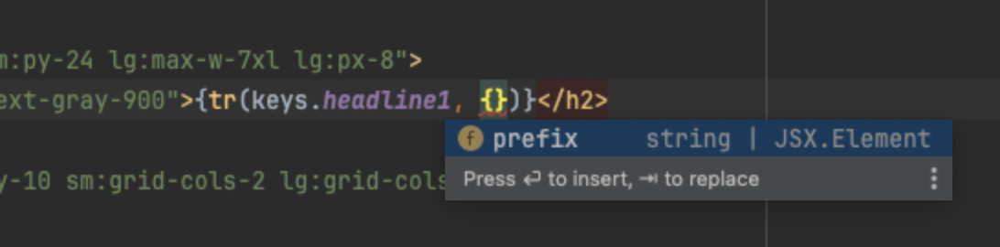

## Nextjs Case Study

### Introduction

Welcome to our case study. This case study is designed to test your ability to work with Next.js and TypeScript.
We will be mostly looking at how you solve the problems we present to you, therefore, please also describe a bit of your thought
process about the decisions you made in a README.

This app consists of a single page of an e-commerce webshop showing some products and a review section. There are some
issues with the shop and some open tasks to do (see below), and we would like you to solve them.

Please do not spend more than 4 hours on this assignment. If you don't finish, don't worry. We are more interested in how you approach the problems and how you solve them.

### Some technical details

The shop uses a dummy API to fetch the products and reviews. You can find the docs for the API here: https://dummyjson.com/docs

### Assignment

First of all:

1. You are not expected to write any tests for this assignment.
2. The way things look is not so important, so don't spend too much time on styling.
3. The documentation of the code is very scarce on purpose :), however, if something is really not clear, you can always reach out to us.

### Tasks

#### API Type Hypes
None of the API calls is typed. Please make sure that the responses of the API calls are validated so we are 100% sure about the type.

#### Translation Typo Turmoil
We are using a translation implementation for the shop. The translation typing is not working properly, it seems there is a bug or maybe something is missing.
Please fix the implementation so that typing works (as in the pic below).

#### Page Load Lag!
It appears that the page sometimes takes a long time to load. Can you please find out why and make sure that when the page takes a long time to load, the part that is causing the delay does not influence the rest of the page?

#### Pageload Panic Fix!
Our customers are really upset. Sometimes on page load, there is an error and the whole page breaks. Please find out the issue and make sure that all API calls handle errors gracefully. Keep type safety in mind; we want to be sure that:

- when an error occurs, we know it in the TSX component and know the type of the error, so we can handle it.
- if there is no error, we have the correct type (like reviews, products) in the TSX component. Maybe you already solved this in the first task?
